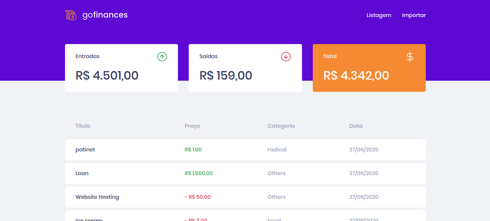
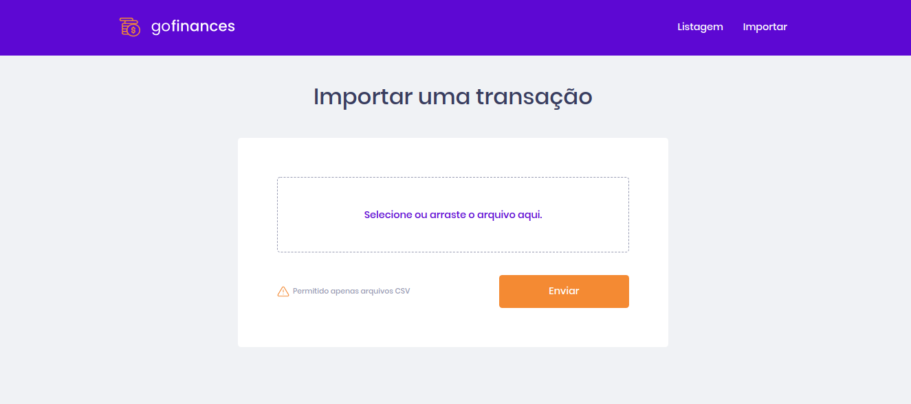

<p align="center">
  
</p>

# GoFinancesWeb
Este repositório é referente ao desafio 'Fundamentos do ReactJS' do Bootcamp GoStack 12.0, da Rocketseat 🚀.

# Proposta
Essa será uma aplicação que irá se conectar ao seu backend, e exibir as transações criadas e permitir a importação de um arquivo CSV para gerar novos registros no banco de dados.

<p align="center">
  
</p>
<p align="center">
  
</p>

# Tecnologias Utilizadas 🚀
React ⚛️ <br />
React Router ⚛️ <br />
Typescript 🦕

# Como obter esse repositório?
Para obter esse projeto, siga os passos:
1. Clone esse repositório utilizando <code>git clone</code>.
2. Rode o comando <code> yarn </code> na raíz da pasta do projeto clonado para baixar as dependências.
3. Rode <code> yarn start </code> na raíz da pasta do projeto para inicializar o Metro Bundler.
4. Abra o projeto no navegador.

⚠️ Caso o projeto não mostre os produtos, rode <code>adb reverse tcp:3333 tcp:3333</code> antes de iniciar a Fake API ⚠️

# Como Contribuir?
**Faça um fork deste repositório**

```bash
# Clone o seu fork
$ git clone url-do-seu-fork && cd GoMarketplace

# Crie uma branch com sua feature ou correção de bugs
$ git checkout -b minha-branch

# Faça o commit das suas alterações
$ git commit -m 'minhas alterações'

# Faça o push para a sua branch
$ git push origin minha-branch
```

Delete sua branch, se quiser, quando o merge da sua pull request for feito. <br />


